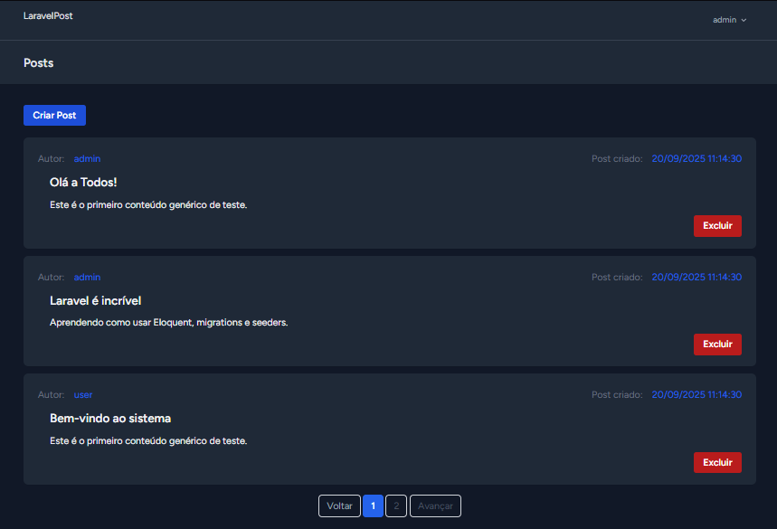
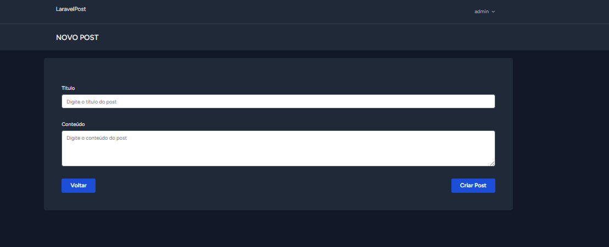

## Projeto LaravelPost

## Requisitos

* PHP 8.2 ou superior - Conferir a versão: php -v
* Composer - Conferir a instalação: composer --version
* Node.js 22 ou superior - Conferir a versão: node -v
* GIT - Conferir se está instalado o GIT: git -v


## Objetivo

```sh
O projeto LaravelPost tem como objetivo o desenvolvimento de um sistema de gerenciamento de posts que utilize autenticação e autorização para garantir a segurança e integridade das informações.

A autenticação será implementada com o Laravel Breeze, proporcionando um fluxo eficiente e seguro para registro e login de usuários. Já o controle de autorização será realizado por meio do recurso Gates, assegurando que cada usuário execute apenas as ações compatíveis com seu nível de permissão.

Foram definidos três perfis de acesso:

Administrador (Admin): possui privilégios para criar posts e excluir qualquer publicação do sistema, independentemente do autor.

Usuário: pode criar seus próprios posts e excluir apenas aqueles que foram criados por ele.

Visitante: possui acesso restrito apenas à visualização dos posts, sem autorização para criar ou excluir publicações.

Dessa forma, o sistema LaravelPost busca promover boas práticas no uso de autenticação e autorização no framework Laravel, além de servir como base de estudo para sistemas de controle de acesso baseados em perfis de usuários.

```

  ## 🚀 Tecnologias Utilizadas

```sh
Laravel 12

Laravel Breeze

Laravel Gates

PHP 8.2+

PostgreSQL

MVC

Seeder

ORM

Blade

Soft Delete

Hard Delete

FormRequest

Capturando e Validando IDs Encriptados

Middleware

Tailwind CSS - Front End

Rotas

Refatoração de código

Github

Git

Criando Query para paginação

Lidando com Listagem de dados

CRUD - Create, Delete.

 ```

### Instalações

* Instalar dependências do PHP
 - Certifique-se de ter PHP >= 8.1 (ou a versão exigida pelo projeto).
 - Instale também Composer, que é o gerenciador de dependências do PHP.

```sh
composer install
```

* Criar arquivo .env
 - Copie o .env.example para .env:

 * Gerar a chave do aplicativo

```sh
  php artisan key:generate
```

* Rodar as migrates e Seeders

```sh
php artisan migrate:fresh --seed
```

* Depencia do Front end

- npm install
- npm run dev

* iniciar o servidor

```sh
php artisan serve
```

* Instalação do Laravel Breeze

 - composer require laravel/breeze --dev
 - php artisan breeze:install
 - npm install
 - npm run dev  -> executar após php artisan serve

 * Traduzir projeto para Portugues no laravel

 - https://github.com/lucascudo/laravel-pt-BR-localization

 - php artisan lang:publish
 - composer require lucascudo/laravel-pt-br-localization --dev
 - php artisan vendor:publish --tag=laravel-pt-br-localization

### Dados da Seeders Users

- Admin: admin@gmail.com
  Senha: Admin123

 - user: user@gmail.com
  Senha: Admin123

- visitante: user@gmail.com
  Senha: Admin123

### PAGINA DE POSTS



### PAGINA CRIANDO POST


